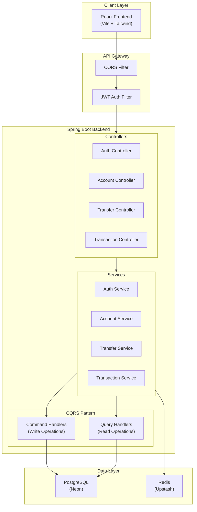
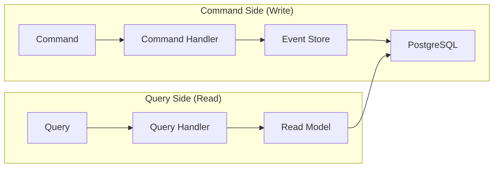
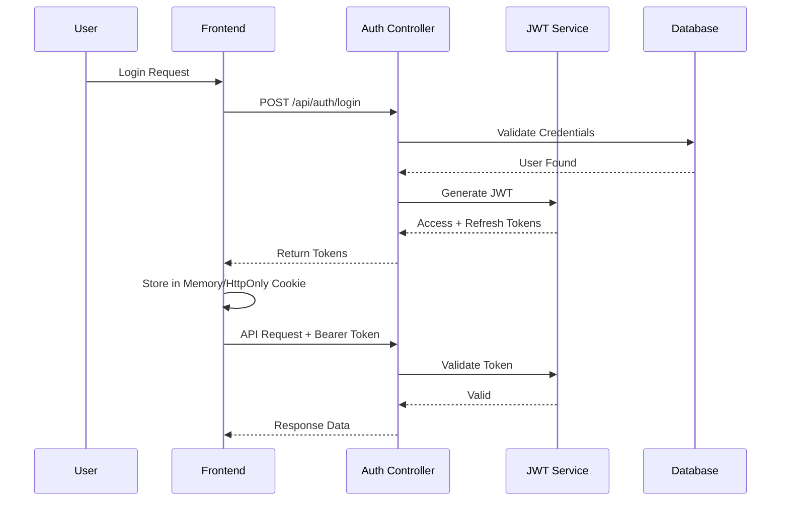

# System Architecture

## High-Level Architecture

---

## Component Breakdown

| Component | Responsibility |
|-----------|----------------|
| **Auth Controller** | Register, Login, Token Refresh |
| **Account Controller** | Create, View, Close Accounts |
| **Transfer Controller** | Initiate transfers between accounts |
| **Transaction Controller** | View transaction history |
| **Redis Cache** | Session tokens, Rate limiting |

---

## CQRS Implementation

**Write Model (Commands):**
- `CreateAccountCommand`
- `TransferFundsCommand`
- `CloseAccountCommand`

**Read Model (Queries):**
- `GetAccountBalanceQuery`
- `GetTransactionHistoryQuery`
- `GetAccountDetailsQuery`

---

## Security Architecture

