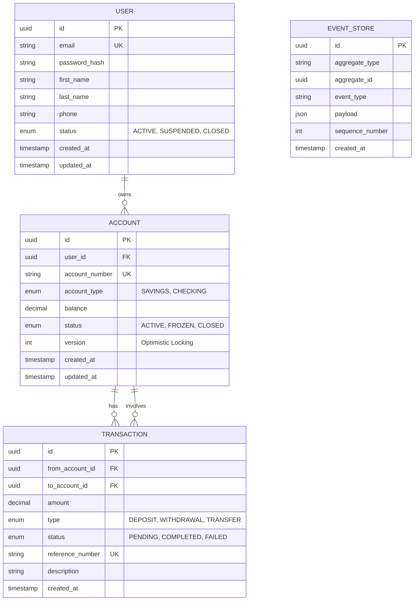

# Database Schema (ERD)

## Entity Relationship Diagram



---

## Table Definitions

### Users Table
| Column | Type | Constraints |
|--------|------|-------------|
| id | UUID | PRIMARY KEY |
| email | VARCHAR(255) | UNIQUE, NOT NULL |
| password_hash | VARCHAR(255) | NOT NULL |
| first_name | VARCHAR(100) | NOT NULL |
| last_name | VARCHAR(100) | NOT NULL |
| phone | VARCHAR(20) | |
| status | ENUM | DEFAULT 'ACTIVE' |
| created_at | TIMESTAMP | DEFAULT NOW() |
| updated_at | TIMESTAMP | DEFAULT NOW() |

### Accounts Table
| Column | Type | Constraints |
|--------|------|-------------|
| id | UUID | PRIMARY KEY |
| user_id | UUID | FOREIGN KEY → users.id |
| account_number | VARCHAR(20) | UNIQUE, NOT NULL |
| account_type | ENUM | NOT NULL |
| balance | DECIMAL(15,2) | DEFAULT 0.00 |
| status | ENUM | DEFAULT 'ACTIVE' |
| version | INTEGER | DEFAULT 0 (Optimistic Lock) |
| created_at | TIMESTAMP | DEFAULT NOW() |
| updated_at | TIMESTAMP | DEFAULT NOW() |

### Transactions Table
| Column | Type | Constraints |
|--------|------|-------------|
| id | UUID | PRIMARY KEY |
| from_account_id | UUID | FOREIGN KEY → accounts.id |
| to_account_id | UUID | FOREIGN KEY → accounts.id |
| amount | DECIMAL(15,2) | NOT NULL |
| type | ENUM | NOT NULL |
| status | ENUM | DEFAULT 'PENDING' |
| reference_number | VARCHAR(50) | UNIQUE |
| description | TEXT | |
| created_at | TIMESTAMP | DEFAULT NOW() |

### Event Store Table (for Event Sourcing)
| Column | Type | Constraints |
|--------|------|-------------|
| id | UUID | PRIMARY KEY |
| aggregate_type | VARCHAR(100) | NOT NULL |
| aggregate_id | UUID | NOT NULL |
| event_type | VARCHAR(100) | NOT NULL |
| payload | JSONB | NOT NULL |
| sequence_number | INTEGER | NOT NULL |
| created_at | TIMESTAMP | DEFAULT NOW() |

---

## Indexes

```sql
-- Performance indexes
CREATE INDEX idx_accounts_user_id ON accounts(user_id);
CREATE INDEX idx_transactions_from_account ON transactions(from_account_id);
CREATE INDEX idx_transactions_to_account ON transactions(to_account_id);
CREATE INDEX idx_transactions_created_at ON transactions(created_at DESC);
CREATE INDEX idx_event_store_aggregate ON event_store(aggregate_type, aggregate_id);
```
